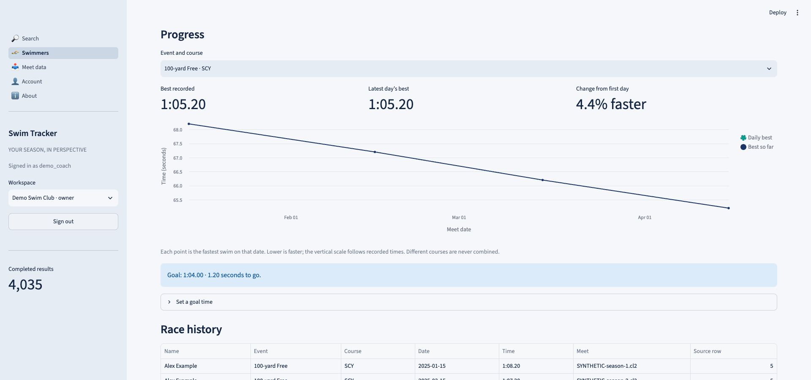
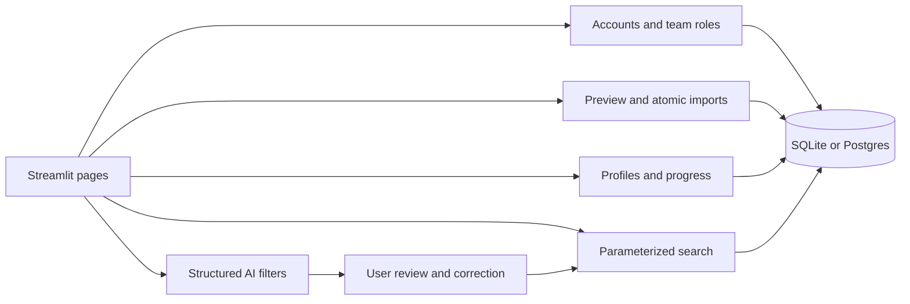

# Swim Tracker

[](https://github.com/Brandon-Xu1/Swim-Tracker/actions/workflows/tests.yml)

Turn uploaded swim-meet files into searchable results and swimmer progress histories.
Built with Python, Streamlit, SQLAlchemy and optional structured AI search.

- **Swimmer profiles:** best times by event and course, daily progress, race history,
  goal times and CSV exports. Coaches can merge or separate mistaken identity matches.
- **Reliable imports:** CL2 and ZIP previews report accepted, excluded and invalid rows;
  renamed duplicates are detected; results, original files and profile links commit together.
- **Individual accounts:** team owners invite coaches or viewers using expiring one-time
  codes. Recovery codes reset passwords and revoke existing sessions.
- **Search:** persistent filters, pagination, total-match counts, source meet attribution,
  and charts that compare only the same event and course.
- **Optional AI:** questions become editable filters. Unsupported analysis requests are
  reported explicitly. Account and deployment quotas persist across restarts.

Profiles describe **uploaded meets only**, not complete lifetime or national histories.
The included four-meet [fictional season](docs/demo) demonstrates progress without
requiring external data access.



## Run locally

Python 3.12 is recommended. Docker and a separate database server are not required.

```bash
python3.12 -m venv .venv
source .venv/bin/activate
python -m pip install -r requirements.txt
streamlit run streamlit_app.py
```

Open http://localhost:8501. A public sample meet is seeded once. Deleting it does not
cause it to return on restart. Normal search and profiles work without an API key.

To try the complete workflow:

1. Open **Account**, create an individual account, and save its recovery code.
2. Create a team. The sidebar switches to that workspace.
3. Open **Meet data** and select the four CL2 files in `docs/demo`.
4. Review each preview and import each meet.
5. Open **Swimmers**, choose Alex Example, and inspect the 100-yard Free trend.
6. Save a goal of `1:04.00`, then create a viewer invitation on Account.

The [demo guide](docs/DEMO.md) includes a two-minute walkthrough and a user-feedback plan.

## Accounts and permissions

| Role | Search, profiles, downloads | Import/remove meets; goals; identity corrections | Invite and manage members |
| --- | --- | --- | --- |
| Anonymous | Public sample | No | No |
| Viewer | Public sample and own selected team | No | No |
| Coach | Public sample and own selected team | Yes, own team | No |
| Owner | Public sample and own selected team | Yes, own team | Yes |

A password change or recovery invalidates every session for that account. Recovery is
code-based; there is no email service. Store the code securely: losing both it and the
password requires operator assistance. Login, registration, recovery and invitation
redemption attempts are throttled in the database.

Existing teams can be retained: create an individual account, then use **Account →
Migrate an existing team account** with the old team password. The first claimant
becomes owner; the shared team password is disabled. Existing uploads stay in place.

## Configuration

Environment variables take precedence over `.streamlit/secrets.toml`.
Real secrets are ignored by Git; `.env` is not automatically loaded by this app.

| Setting | Default | Purpose |
| --- | --- | --- |
| `SWIMTRACKER_DB_PATH` | `swim_data.db` | Local database override; also isolates tests/demos |
| `DATABASE_URL` | Unset | Optional hosted Postgres connection |
| `ADMIN_PASSWORD` | Unset | Unlocks writes to the public sample |
| `ALLOW_PUBLIC_WRITES` | `false` | Explicit local-development bypass; keep false on public deployments |
| `OPENAI_API_KEY` | Unset | Enables AI search for signed-in accounts |
| `OPENAI_MODEL` | `gpt-5.6-luna` | Must be available to your API project |
| `AI_DAILY_CALL_LIMIT` | `200` | Deployment-wide requests in a rolling 24 hours |

AI limits also include 5 requests/minute and 30/hour per account, and 30/minute
across the deployment. Identical cached requests by the same account do not consume
quota. Cache entries expire after 24 hours and are keyed by date, model, available
groups and account. Questions are limited to 1,000 characters; requests have a
20-second timeout, no automatic retries and a 1,000-output-token limit.
These request limits bound calls, not an exact dollar budget. Review provider usage
and billing controls separately. New accounts cannot bypass the global limit.

Public data is **read-only when no admin password is configured**. Private team
uploads remain available to owners/coaches. Do not enable `ALLOW_PUBLIC_WRITES` on
a shared deployment. Changing the admin password invalidates existing admin unlocks.

Previously committed API keys still need revocation; deleting a file or adding it to
`.gitignore` does not remove credentials from Git history.

## Import integrity and profile matching

Uploads may contain CL2 files or ZIPs with up to 20 CL2 files, totaling at most 8 MB
uncompressed per archive. Archives are read in memory without extracting paths.
SD3, HY3, PDFs and relay results are not currently supported.

Each preview separates completed results, records without a completed time, and
parse errors with line numbers. A partial import requires explicit acknowledgment.
Replacing different data with the same filename requires confirmation. A fingerprint
of the parsed result set detects copies with different filenames or row ordering.
An import has a stable internal identifier; a filename identifies replacements
within a team. Overlapping exports with different result subsets still require review.

Profile matching uses a source athlete identifier **plus name and gender**, scoped to
one team. Names alone never merge profiles. Missing identifiers remain source-specific;
ambiguous matches stay separate. These identifiers are not assumed to be a universal
swimmer registry. Coaches can confirm merges or separate a meet; source mappings keep
those corrections across unchanged reimports. Goals are event/course-specific.

New application tables are additive. The known legacy schema without `team_id` receives
that column with public scope. Other unsupported schemas stop with existing data intact;
startup never calls the destructive rebuild helper. `app_meta.schema_revision` records
the current local schema revision. A full migration framework is outside this iteration.

## Architecture



Page code is in `swim_tracker/ui`. Services enforce write permissions independently of
widget visibility. Imports and profile edits serialize by team; quota reservations are
atomic across processes. SQL always uses bound values. The model never produces executed
SQL. CSV exports neutralize leading spreadsheet formula characters.

For persistent hosting, set `DATABASE_URL` to your hosted Postgres instance. The included
`render.yaml` starts Streamlit on Render's assigned port. Local SQLite storage on an
ephemeral hosting filesystem can disappear on redeploy; use a persistent volume or Postgres
for retained uploads. Backups and hosting availability are the operator's responsibility.

## Tests and quality checks

```bash
python -m pip install -r requirements-dev.txt
python -m unittest discover -s tests -v
ruff check streamlit_app.py swim_tracker scripts tests
ruff format --check streamlit_app.py swim_tracker scripts tests
python -m scripts.evaluate_ai
```

Tests include rollback after a failed import, concurrent duplicate uploads, persisted
quotas, recovery/invitation expiry and reuse, session revocation, viewer restrictions,
team isolation, identity corrections, course-specific calculations, safe startup,
pagination, and Streamlit page flows. CI provisions Postgres and additionally runs the
database/workflow suites against it. Locally those cases skip unless
`SWIMTRACKER_TEST_DATABASE_URL` points to a **disposable test database**; the fixtures
remove its application tables.

## Measurements

```bash
python -m scripts.benchmark --rows 100000 --queries 40 --output docs/benchmark.json
```

The committed [benchmark report](docs/benchmark.json) is a synthetic, local SQLite run:
100,000 rows, 2,000 synthetic athlete identifiers and 40 measured queries per category.
On the recorded ARM64 macOS/Python 3.12.8 environment, p95 was **15.02 ms** for name
search and **72.70 ms** for event ranking. Measurements include SQL, DataFrame creation
and total-match counting; they exclude browser/network time and concurrent users.
They establish a reproducible baseline, not production capacity or real-user adoption.

The AI evaluation set contains 30 labeled questions including unsupported requests,
relative dates, event aliases and adversarial instructions. Offline validation checks
fixture schemas only. Live evaluation is opt-in and makes billable requests:

```bash
python -m scripts.evaluate_ai --live --model YOUR_MODEL --output evals/latest-results.json
```

The report includes exact filter accuracy, per-field accuracy, unsupported-request
accuracy, latency and token usage. Supply `--input-price-per-million`,
`--cached-input-price-per-million`, and `--output-price-per-million` using your provider's
current prices to estimate cost per query. No live accuracy or cost result is claimed
until that evaluation has run. The small curated set should grow with real user questions.
